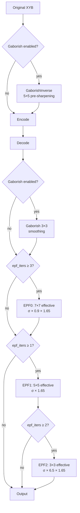

# Gaborish and Edge-Preserving Filter



Two decoder-side filters applied after IDCT: **Gaborish** (a fixed 3×3 smoothing
convolution) and **EPF** (an adaptive edge-preserving filter with 1–3 stages).
The encoder applies an approximate inverse Gaborish before quantization so the
full encode-decode system preserves the original signal more faithfully.

Source: `enc_gaborish.cc`, `stage_gaborish.cc`, `stage_epf.cc`, `epf.cc`, `loop_filter.h/cc`

## Gaborish: Fixed 3×3 Smoothing (Decoder Side)

A mild deblocking/smoothing convolution applied identically to all pixels:

```
w2  w1  w2
w1  w0  w1
w2  w1  w2

w1 = 1.1 × 0.1047 = 0.1152    (4-connected neighbors)
w2 = 1.1 × 0.0557 = 0.0612    (diagonal neighbors)
w0 = 1.0                       (center)
```

All three XYB channels use the same weights. After normalization
(`sum = 1 + 4(w1 + w2) = 1.706`):

```
center:   0.586
edge:     0.068
diagonal: 0.036
```

Custom per-channel weights can be signaled in `LoopFilter` but the default is
uniform across channels.

## Gaborish Inverse: 5×5 Pre-Sharpening (Encoder Side)

The encoder applies an approximate inverse via `Symmetric5()` — a 5×5 symmetric
convolution. This is NOT the algebraic inverse of the 3×3 kernel (the comment
says "One or even two 3x3, and rank-1 5x5 are insufficient"). The coefficients
were optimized by butteraugli for the full encode-decode system:

```
kGaborish[5] = {
    -0.09496,    // 4-connected (distance 1)
    -0.04103,    // diagonal (distance √2)
     0.01371,    // axis-aligned distance 2
     0.00651,    // knight's-move (distance √5)
    -0.00148     // corner (distance 2√2)
}
```

With `mul = 1.0`: `sum = 1 + 4×(-0.09496 + -0.04103 + 0.01371 + -0.00148 + 2×0.00651) = 0.555`

`normalize = 1/0.555 = 1.802`

The center coefficient after normalization is 1.802 — this is a **sharpening**
filter. The mostly-negative neighbor weights subtract surrounding pixels,
pre-compensating for the decoder's blurring.

## Gaborish Activation

Gaborish is enabled when ALL of:
- `speed_tier ≤ Hare (5)`
- VarDCT encoding
- `decoding_speed_tier < 4`
- `butteraugli_distance > 0.5`
- Perceptual optimizations not disabled

At distance ≤ 0.5 (very high quality), the smoothing would destroy detail that
the quantization can preserve.

## Edge-Preserving Filter (EPF)

An adaptive, nonlinear filter that selectively smooths quantization noise in flat
regions while preserving edges. Unlike Gaborish, EPF uses per-block sigma values
derived from the quantization field.

### Sigma Computation

```
sigma_quant = epf_quant_mul / (quant_scale × row_quant[bx] × kInvSigmaNum)
sigma = sigma_quant × epf_sharp_lut[sharpness[bx]]
```

| Parameter | Default | Purpose |
|-----------|---------|---------|
| `epf_quant_mul` | 0.46 | Base sigma multiplier |
| `kInvSigmaNum` | -1.1716 | = 4(√0.5 − 1), calibrated so Weight(σ)=0.5 |
| `epf_sharp_lut[i]` | i/7 | Linear ramp, 8 entries |
| `kMinSigma` | -3.905 | Below this, skip filtering |

The sigma is inversely proportional to the quantization level — heavily
quantized blocks get stronger filtering (more noise to remove), while
high-quality blocks get weaker or no filtering.

### Weight Function

All EPF stages use a linearly-decaying weight:

```
weight = max(0, sad × inv_sigma + 1.0)
```

At `sad = 0`: weight = 1.0. At `sad = sigma`: weight = 0.0. Neighbors more
different than sigma from the center are completely excluded. The center pixel
always has weight 1.0.

### Border Handling

Pixels at 8×8 block boundaries get tighter filtering via `epf_border_sad_mul = 2/3`:

```
border_sigma = sigma × 2/3
```

This reduces cross-block smoothing, preventing the filter from smearing
across quantization discontinuities at block edges.

### EPF0: 5×5 Plus-Shaped (7×7 Effective)

- **12 neighbor offsets** in a plus pattern at radius 2
- **SAD**: 5-pixel plus-shaped patch across all 3 channels with
  `epf_channel_scale = {40, 5, 3.5}` (X:Y:B weighting)
- **Sigma**: `σ × 0.9 × 1.65 = σ × 1.485`
- **Threshold**: `epf_pass1_zeroflush = 0.45`
- Only activated at `epf_iters ≥ 3` (distance ≥ 4.0)

### EPF1: 3×3 Plus (5×5 Effective)

- **4 neighbors**: up, down, left, right
- **SAD**: 5-pixel plus-shaped patch, same channel weighting
- **Sigma**: `σ × 1.65`
- **Threshold**: 0.45
- Core stage, always present when EPF is active

### EPF2: 3×3 Single-Pixel SAD

- **4 neighbors**: up, down, left, right
- **SAD**: simple per-pixel L1 distance (no patch)
- **Sigma**: `σ × 6.5 × 1.65 = σ × 10.725`
- **Threshold**: `epf_pass2_zeroflush = 0.6`
- Much stronger blur (10.7× base sigma) but simpler similarity — a final
  refinement pass

### EPF Iteration Count

| butteraugli_distance | epf_iters | Stages | Total border |
|---------------------|-----------|--------|-------------|
| < 0.7 | 0 | None | 0 |
| 0.7 – 1.5 | 1 | EPF1 | 2 |
| 1.5 – 4.0 | 2 | EPF1, EPF2 | 3 |
| ≥ 4.0 | 3 | EPF0, EPF1, EPF2 | 6 |

(For `decoding_speed_tier ≥ 3`: always 0. For tier 2: first threshold skipped.)

### EPF Channel Sensitivity

The SAD channel weights `{40, 5, 3.5}` for X:Y:B mean X (roughly luma
difference in XYB) dominates edge detection by 8:1 over Y and 11:1 over B.
This matches human visual sensitivity — luminance edges are detected
far more precisely than chrominance edges.

## Encoder-Side Sharpness Optimization

For `distance ≥ 0.5` and `speed ≤ Wombat (4)`, the encoder optimizes per-block
EPF sharpness values (0–7 index into `epf_sharp_lut`):

1. Define candidates: `{0, 2, 7}` for distance ≤ 4.5, or `{0, 4}` for higher
2. Full reconstruct per candidate → per-block L2 error
3. Pick lowest-error candidate per block, bias toward 0 (`kFavorNoSmoothing = 0.99`)
4. Second pass: apply context-dependent cost (top/left neighbor contexts)

At faster speeds, all blocks get sharpness = 4 (the midpoint).

## The 1.65 Constant

All three EPF stages multiply sigma by 1.65. This appears as a literal without
explanation. It calibrates the linear-decay weight function so that the
half-weight distance (where weight = 0.5) occurs at `sad = 0.5 / 1.65 ≈ 0.3σ`,
matching the desired perceptual threshold for "same vs. different" pixel content.
