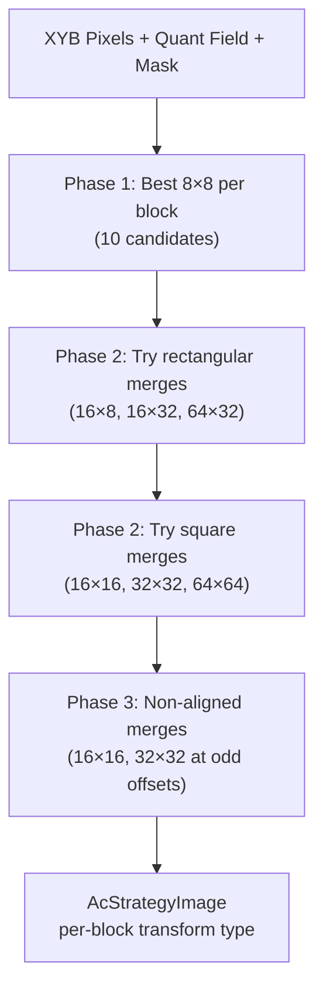

# AC Strategy (Block Size Selection)



AC strategy selection is the encoder's single most consequential rate-distortion decision.
For each region of the image, it chooses which DCT transform size to use — from 4×4 up to
64×64 — directly controlling how bits are distributed between frequency resolution and
spatial resolution. The selection is driven entirely by cost functions that estimate
rate + distortion for each candidate transform.

Source: `enc_ac_strategy.cc` (1200 lines), `enc_ac_strategy.h`, `ac_strategy.h`

## The 27 Transform Types

`AcStrategyType` enumerates all supported transforms:

| Type | Pixels | 8×8 blocks | Used in merge heuristics |
|------|--------|-----------|------------------------|
| DCT 8×8 | 8×8 | 1 | Base case |
| DCT4X4 | 4×4 (×4) | 1 | Phase 1 candidate |
| DCT2X2 | 2×2 (Haar) | 1 | Phase 1 candidate |
| DCT4X8 / DCT8X4 | 4×8 | 1 | Phase 1 candidate |
| IDENTITY | pixel-domain | 1 | Phase 1 candidate |
| AFV0–AFV3 | asymmetric 8×8 | 1 | Phase 1 candidate |
| DCT16X8 / DCT8X16 | 16×8 | 2 | Rectangular merge |
| DCT16X16 | 16×16 | 4 | Square merge |
| DCT16X32 / DCT32X16 | 16×32 | 8 | Rectangular merge |
| DCT32X32 | 32×32 | 16 | Square merge |
| DCT64X32 / DCT32X64 | 64×32 | 32 | Rectangular merge |
| DCT64X64 | 64×64 | 64 | Square merge |
| DCT128+ | 128–256 | 128–1024 | Enum exists, not used |

Each block is stored as a `uint8_t` per 8×8 block: 7-bit strategy type + 1-bit
`is_first_block` flag.

## ACSConfig: What the Cost Function Sees

```cpp
struct ACSConfig {
    const DequantMatrices* dequant;        // quantization matrices
    const float* quant_field_row;          // per-block quantization level
    const float* masking_field_row;        // per-block masking
    const float* masking1x1_field_row;     // per-pixel masking
    const float* src_rows[3];             // XYB source pixels
    float info_loss_multiplier;            // distortion weight
    float cost_delta;                      // entropy cost weight
    float zeros_mul;                       // zero-count cost weight
};
```

## Rate-Distortion Multipliers

Three base multipliers control the rate-distortion balance, set in
`AcStrategyHeuristics::Init` (`enc_ac_strategy.cc`):

```
info_loss_multiplier = 1.2        // distortion weight
zeros_mul            = 9.309      // zero-count encoding cost
cost_delta           = 10.833     // per-coefficient entropy cost
```

These are **adjusted by butteraugli distance** via power functions:

```
kBias = 0.137
ratio = (butteraugli_distance + kBias) / (1.0 + kBias)

info_loss_multiplier *= pow(ratio, 0.337)
zeros_mul            *= pow(ratio, 0.510)
cost_delta           *= pow(ratio, 0.367)
```

At high quality (low distance), `ratio < 1` → all multipliers shrink → the cost function
favors rate reduction (smaller transforms, more zeros). At low quality, multipliers grow
→ favors minimizing distortion (larger transforms that capture more structure).

## EstimateEntropy: The Core Cost Function

`enc_ac_strategy.cc:364-511` — this is where every transform decision is made.

### Step 1: Forward Transform

Apply the candidate DCT to source XYB pixels for all three channels.

### Step 2: Quantization Norm

Aggregate the per-block quant values covered by this transform:

- **1 block**: direct value
- **2 blocks**: `max` of both (the comment says "seems to work better than 8th norm")
- **4+ blocks**: 16th-norm:
  ```
  quant_norm16 = (mean(quant[i]^16))^(1/16)
  ```
  The 16th-norm is between max and mean — heavily weights the highest-quant block
  but still accounts for spatial variation.

### Step 3: Rate Estimate (Entropy)

For each channel c, for each coefficient i in scan order:

```
val = (coeff[i] - Y_coeff[i] * cmap_factor[c]) * inv_quant_matrix[i] * quant_norm16
rval = round(val)
q = |rval|

entropy += sqrt(q)       // NOT q*C — "punishing large values less aggressively"
nzeros += (q != 0)
```

The `sqrt(q)` entropy model is notable. Standard cost models use `q * C` or
`log2(q)`. The square root was chosen because linear cost "seems to be
punishing large values more than necessary" — it provides a gentler penalty
that better matches the actual distribution of quantized coefficients.

The zero-count cost:

```
nbits = CeilLog2(nzeros + 1) + 1
entropy_channel = cost_delta * sum(sqrt_entropy)
                + zeros_mul * (CeilLog2(nbits + 17) + nbits)
```

### Step 4: X-Channel Penalty for Large Blocks

```
if channel == X and num_blocks >= 2:
    w = 1.0 + min(3.0, num_blocks / 8.0)
    entropy *= w
    loss *= w
```

At DCT64×64 (`num_blocks=8`): `w = 2.0`, doubling the X-channel cost.
Large transforms in the red-green opponent channel produce visible ringing
artifacts, so they are explicitly penalized.

### Step 5: Distortion (Information Loss)

Reconstruct the quantization error in pixel domain and compute a weighted 8th-power norm:

```
diff_coeffs[i] = quant_matrix[i] * (val - round(val))
inverse_transform(diff_coeffs) → error_pixels

masku_lut = {12.0, 0.0, 4.0}     // X=12, Y=0, B=4 masking offsets

for each pixel:
    masked_error = (masking1x1[pixel] + masku_lut[c]) * error_pixel
    lossc += masked_error^8

kChannelMul = { 8.2^8, 1.0^8, 1.03^8 }    // X≈2.09e7, Y=1.0, B≈1.27
lossc *= kChannelMul[c]
```

The 8th-power norm sits between L2 (too forgiving of spikes) and L-infinity
(too harsh). The `kChannelMul` weights make the X channel ~20 million times
more sensitive than Y — reflecting that chrominance errors in the XYB opponent
channel are extremely visible.

### Step 6: Combine Rate + Distortion

```
loss_scalar = (sum(loss) / (num_blocks * 64))^(1/8) * (num_blocks * 64) / quant_norm16
entropy *= entropy_mul     // per-transform bias multiplier
total_cost = entropy + info_loss_multiplier * loss_scalar
```

## Per-Transform Entropy Multipliers

Each transform type has a bias multiplier that adjusts its cost relative to DCT8×8:

### 8×8-Level Candidates

| Transform | `entropy_mul` | Relative to DCT8×8 | Speed gate |
|-----------|--------------|--------------------|----|
| DCT 8×8 | 0.80 | 1.00 (reference) | ≤ 9 |
| DCT 4×4 | 1.08 | 1.35 | ≤ 5 |
| DCT 2×2 | 0.95 | 1.19 | ≤ 5 |
| DCT 4×8 / 8×4 | 0.859 | 1.07 | ≤ 4 |
| IDENTITY | 1.043 | 1.30 | ≤ 5 |
| AFV0–3 | 0.818 | 1.02 | ≤ 4 |

The actual multiplier used is `tx.entropy_mul / DCT8_entropy_mul`, so DCT8×8 = 1.0.

### Quality-Dependent Adjustments to 8×8 Selection

At high quality (target < 5.0), DCT2×2 and IDENTITY get cheaper:
```
kFavor2X2AtHighQuality = 0.4
weight = ((5.0 - target) / 5.0)^2
entropy_mul -= 0.4 * weight
```

At low quality (target > 4.0), non-standard transforms get more expensive:
```
kAvoidEntropyOfTransforms = 0.5
mul = 1.0                              if target >= 12.0
mul = (12.0 - 4.0) / (target - 4.0)   if 4.0 < target < 12.0
entropy_mul += 0.5 * mul
```

### Merge Entropy Multipliers (Larger-than-8×8)

| Transform | `entropy_mul` |
|-----------|--------------|
| DCT 16×8 / 8×16 | 1.21 |
| DCT 16×16 | 1.34 |
| DCT 16×32 / 32×16 | 1.49 |
| DCT 32×32 | 1.48 |
| DCT 64×32 / 32×64 | 2.25 |
| DCT 64×64 | 2.25 |

All > 1.0, making larger transforms more expensive. The comment: "Optimization
will find smaller numbers and produce more ringing than is ideal."

### 8×8 Favor Multiplier

A quality-dependent discount applied to all 8×8 candidates before merging:

```
k8x8mul1 = -0.4
k8x8mul2 = 1.0
k8x8base = 1.4
mul8x8 = k8x8mul2 + k8x8mul1 / (butteraugli_target + k8x8base)
```

| Target | mul8x8 | 8×8 discount |
|--------|--------|-------------|
| 1.0 | 0.833 | 17% |
| 5.0 | 0.938 | 6% |
| 10.0 | 0.965 | 3.5% |

## Decision Tree: Block Size Selection

### Phase 1: Best 8×8 Transform

`FindBest8x8Transform` (`enc_ac_strategy.cc:513-613`)

For each 8×8 block in a 64×64 region:
1. Evaluate all speed-gated single-block candidates via `EstimateEntropy()`
2. Apply per-transform `entropy_mul` bias
3. Select the minimum-cost candidate
4. Multiply selected cost by `mul8x8` discount

### Phase 2: Hierarchical Merging

`ProcessRectACS` (`enc_ac_strategy.cc:827-1059`)

Works on a 64×64 block (8×8 in block coordinates):

**Priority-based rectangular merging** (`kTransformsForMerge`):

| Priority | Transform | Decoding speed gate | Encoding speed gate |
|----------|-----------|----|----|
| 2 | DCT16×8 / 8×16 | ≤ 4 | ≤ 5 |
| 4 | DCT16×32 / 32×16 | ≤ 4 | ≤ 4 |
| 6 | DCT64×32 / 32×64 | ≤ 1 | ≤ 3 |

**Square merging** via `FindBestFirstLevelDivisionForSquare()`:

For each candidate square region (2×2, 4×4, 8×8 blocks), compare three options:
1. One square transform (e.g., DCT16×16 for a 2×2 block region)
2. Two vertical rectangles (e.g., 2× DCT16×8)
3. Two horizontal rectangles (e.g., 2× DCT8×16)

```
costJxN = min(rect_left_cost, sum_of_8x8_left) + min(rect_right_cost, sum_of_8x8_right)
costNxJ = min(rect_top_cost, sum_of_8x8_top) + min(rect_bottom_cost, sum_of_8x8_bottom)

if square_cost < costJxN and square_cost < costNxJ:
    → use square transform
elif costJxN < costNxJ:
    → use vertical rectangles where beneficial
else:
    → use horizontal rectangles where beneficial
```

Each rectangle decision is local: if the merged rectangle is cheaper than the
constituent 8×8 blocks, merge. Otherwise keep the 8×8s.

**Non-aligned merging** (Kitten/Tortoise speeds):
- Retry 16×16 at non-2-aligned positions
- Retry 32×32 at non-4-aligned positions

### TryMergeAcs: The Merge Decision

`enc_ac_strategy.cc:618-653`

1. Check if any sub-block already has higher priority → abort (prevents overlaps)
2. Sum current entropy estimates for all sub-blocks
3. Compute `EstimateEntropy()` for the candidate merged transform
4. If candidate < current sum → accept, update priority map and entropy estimates

## Speed Tier Gating

```
Cheetah (≥7): DCT8×8 only (hardcoded, no heuristics)
Hare (5-6):   Phase 1 only (10 candidates per block, no merging)
Wombat (4):   + 16×8/8×16 merge, + 16×32/32×16 merge
Squirrel (3): + 64×32/32×64 merge
Kitten (2):   + non-aligned 32×32 merging (step=2)
Tortoise (1): + non-aligned 32×32 merging (step=1)
```

## Constants Were Tuned Empirically

The comment in the source notes that the constants were optimized with
`simplex_fork.py` (a Nelder-Mead simplex variant) minimizing `BPP * p-norm`,
then manually adjusted by Jyrki Alakuijala for visual quality. The `kChannelMul`
distortion weights (8.2^8 for X) and the entropy multipliers reflect this
joint numerical + human optimization.
