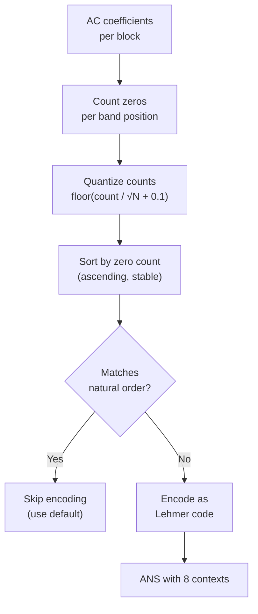

# Coefficient Order



The coefficient order system controls the scan order of DCT coefficients. Rather
than always using a zig-zag order, the encoder can compute a custom permutation
that places zero-heavy coefficient positions later in the sequence, improving
entropy coding through better run-length clustering and earlier end-of-block
symbols.

Source: `coeff_order.h`, `coeff_order.cc`, `enc_coeff_order.h`,
`enc_coeff_order.cc`, `lehmer_code.h`

## Order Buckets

There are 13 order buckets (`kNumOrders`), one per block size class. Transform
pairs differing only in orientation share a bucket:

| Order | Blocks | Coefficients | Transforms |
|-------|--------|-------------|------------|
| 0 | 1×1 | 64 | DCT8 |
| 1 | 1×1 | 64 | IDENTITY, DCT2X2, DCT4X4, DCT4X8, AFV0-3 |
| 2 | 2×2 | 256 | DCT16×16 |
| 3 | 4×4 | 1024 | DCT32×32 |
| 4 | 1×2 | 128 | DCT16×8, DCT8×16 |
| 5 | 1×4 | 256 | DCT32×8, DCT8×32 |
| 6 | 2×4 | 512 | DCT32×16, DCT16×32 |
| 7–12 | 8×8–32×32 | 4096–65536 | DCT64×64 through DCT256×256 |

Total allocation: `kCoeffOrderMaxSize = 6156 × 64 = 393,984` entries across
all buckets, all 3 channels.

The `kStrategyOrder` array maps each of the 27 `AcStrategyType` values to a
bucket index. `CoefficientLayout` normalizes each transform so that the shorter
dimension is rows (e.g., DCT16×8 and DCT8×16 both become 1×2 blocks).

## Natural Order (Generalized Zig-Zag)

`CoeffOrderAndLut` generates the default scan order for any block size:

1. For a block of `(cy×8) × (cx×8)` pixels where `cx ≥ cy`:
   compute aspect ratio `xs = cx / cy`
2. Generate zig-zag for a `(cx×8) × (cx×8)` square
3. Keep only rows where `y % xs == 0`, compress y by dividing by `xs`
4. First `cx × cy` entries are LLF (DC-like) coefficients
5. Remaining entries follow diagonal traversal with alternating direction

For 8×8, this produces the standard JPEG zig-zag. For non-square blocks, the
order adapts to the rectangular frequency grid.

## Order Optimization

`ComputeCoeffOrder` (`enc_coeff_order.cc:66`) computes a custom scan order by
sorting coefficient positions by their zero count.

### Algorithm

**1. Block sampling**: At speed ≥ kSquirrel (3) with only DCT8 in use, samples 50%
of blocks via Xorshift128+ PRNG to reduce work.

**2. Zero counting**: For every sampled block, counts zeros per coefficient
position within each channel, accumulating in `num_zeros[offset + k]`.

**3. LLF protection**: Low-frequency coefficients (the DC-like positions in
multi-block transforms) are forced first by setting `num_zeros = -1`.

**4. Quantized sort**: Per order bucket, per channel:
```
inv_sqrt_sz = 1.0 / sqrt(block_size)
quantized_count = floor(raw_zero_count × inv_sqrt_sz + 0.1)
sort_key = (quantized_count << 16) | original_index
```

The `1/√N` normalization makes counts comparable across block sizes. The
`+ 0.1` bias prevents floating-point truncation. The `<< 16` packing with
`| index` ensures stable sort (equal-count positions preserve zig-zag order).

Sorting ascending: positions with fewer zeros (more information content) come
first, positions with more zeros come last — improving run-length coding and
enabling earlier EOB signals.

**5. Default detection**: If the computed order matches the natural order for
all 3 channels, the bucket is removed from `current_used_orders` to avoid
encoding a no-op permutation.

### Cost Model

The optimization does not use an explicit cost function. Instead, it relies on
the heuristic that placing zero-heavy bands later improves entropy coding
density. The quantized sort key intentionally coarsens the ordering so that
similar-count positions preserve their natural relative order — a finer sort
key would produce a "more optimal" order but cost more bits to encode the
permutation itself.

## Lehmer Code Encoding

Permutations are encoded as Lehmer codes using a Fenwick tree for O(N log N)
complexity.

### Encoding (`ComputeLehmerCode`, `lehmer_code.h:31`)

For each position i, the Lehmer code value is the number of elements smaller
than `permutation[i]` that appear after position i. A Fenwick tree tracks
used elements, and prefix sums compute the count in O(log N) per element.

### Decoding (`DecodeLehmerCode`, `lehmer_code.h:61`)

Reverses the encoding using binary search on Fenwick tree prefix sums to find
the k-th unused element. O(N log² N) total.

### Bitstream Format

```
Token 0: effective_length − skip     (permutation length, trailing identity trimmed)
Token 1..N: lehmer[i]               (each with context from previous value)
```

Context selection: `CoeffOrderContext(val)` maps through `HybridUintConfig(0,0,0)`
producing `floor(log2(val))` for `val ≥ 1`, clamped to [0, 7]
(`kPermutationContexts = 8`).

### Relative Encoding

The bitstream encodes deviation from natural order, not absolute positions.
Before encoding, the optimized order is converted to a natural-order-relative
permutation via `ComputeNaturalCoeffOrderLut`. On decoding, the Lehmer code
is decoded to a permutation, then mapped through the natural order array.

This means:
- **Identity permutation** (natural order) costs essentially zero bits
- **Small perturbations** cost few bits
- **Random permutations** cost the most

## Speed Tier Gating

| Speed | Custom Orders? | Sampling |
|-------|---------------|----------|
| Tortoise (1)–Cheetah (6) | Yes, up to order 6 (≤32×32) | 50% at Squirrel (3)+ if DCT8-only |
| Falcon (7)+ | No (default only) | N/A |

At speed ≥ kFalcon (7), `ComputeUsedOrders` returns only DCT8 as "used" with no
customization — all blocks use the natural zig-zag order.

Orders with bucket index > 6 (the large transforms: 64×64+) are never
customized regardless of speed tier. Images smaller than 5×5 blocks always use
default orders.

## Multi-Pass Support

`ComputeCoeffOrder` accepts `prev_used_acs` and `all_used_orders` to support
progressive encoding:
- Orders committed in previous passes are skipped
- The `all_used_orders` accumulator tracks customization across all passes
- LLF coefficients (first `covered_blocks_x × covered_blocks_y` positions) are
  never permuted — passed as `skip` to the permutation codec
