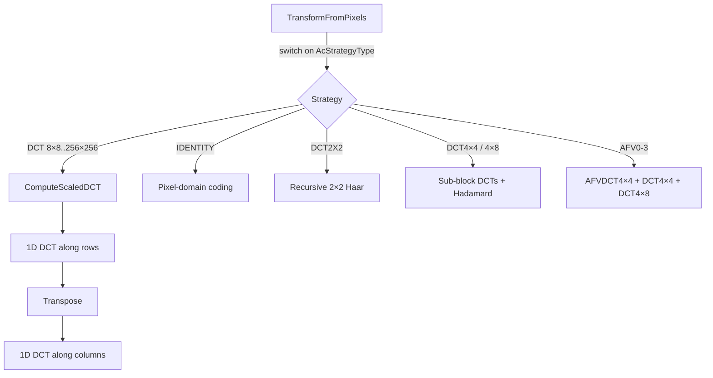

# DCT Transform Family



JPEG XL supports DCT transforms from 4×4 to 256×256 pixels, plus three special
transforms (Identity, DCT2×2, AFV). All are implemented with SIMD via Highway,
using a recursive radix-2 decomposition based on the Perera-Liu algorithm.

Source: `dct-inl.h`, `dct_scales.h`, `dct_block-inl.h`, `transpose-inl.h`,
`enc_transforms-inl.h`, `dec_transforms-inl.h`

## Supported Sizes

| Size | AcStrategyType | 8×8 blocks | Notes |
|------|---------------|-----------|-------|
| 4×4 | DCT4X4 | 1 (4 sub-blocks) | Sub-block within 8×8 |
| 4×8 / 8×4 | DCT4X8 / DCT8X4 | 1 (2 sub-blocks) | Sub-block within 8×8 |
| 8×8 | DCT | 1 | Base case |
| 16×8 through 64×64 | Various | 2–64 | Standard merge sizes |
| 128×64 through 256×256 | Various | 128–1024 | Defined but rarely used |

Maximum: `kMaxCoeffBlocks × kBlockDim = 32 × 8 = 256` pixels per side.

## 2D Transform Structure

All 2D DCTs decompose into two 1D passes with a transpose:

```
Input (ROWS × COLS pixels)
  → 1D DCT along rows (COLS columns in parallel via SIMD)
  → Transpose (ROWS×COLS → COLS×ROWS)
  → 1D DCT along columns
  → Output coefficients
```

For rectangular transforms (ROWS ≠ COLS), the pass order depends on which
dimension is larger, with an extra transpose to keep data in the right layout.

The forward DCT applies `1/N` normalization per dimension (in `StoreToBlockAndScale`).
The IDCT applies no normalization — the pair convention is that forward includes the
scale, inverse is unscaled.

## 1D DCT-II Algorithm (Forward)

`DCT1DImpl<N, SZ>` implements the Perera-Liu radix-2 decimation-in-frequency
decomposition. For a DCT of size N:

```
1. AddReverse:     tmp[i] = in[i] + in[N-1-i]         (butterfly sums)
2. DCT1D<N/2>:    recursive DCT on the sum half
3. SubReverse:     tmp[i] = in[i] - in[N-1-i]         (butterfly differences)
4. Multiply:       apply WcMultipliers twiddle factors
5. DCT1D<N/2>:    recursive DCT on the weighted difference half
6. B matrix:       cascade: c[0] = sqrt(2)×c[0]+c[1]; c[i] = c[i]+c[i+1]
7. InverseEvenOdd: deinterleave even/odd results
```

Base cases: N=1 is identity, N=2 is `{a+b, a-b}`.

### Twiddle Factors

```
WcMultipliers<N>[i] = 1 / (2 × cos((i + 0.5) × π / N))
```

For N=8: `{0.5098, 0.6013, 0.9000, 2.5629}`

### B Matrix Transform

The B matrix accumulates partial sums forward:

```
coeff[0] = sqrt(2) × coeff[0] + coeff[1]
coeff[i] = coeff[i] + coeff[i+1]     for i = 1..N-2
coeff[N-1] unchanged
```

Its transpose (used in the IDCT) reverses: accumulate backward, then scale
element 0 by sqrt(2).

## 1D DCT-III Algorithm (Inverse)

`IDCT1DImpl<N, SZ>` reverses the forward steps:

```
1. ForwardEvenOdd:  gather even/odd positioned coefficients
2. IDCT1D<N/2>:     recursive IDCT on even part
3. BTranspose:      transpose B matrix on odd part
4. IDCT1D<N/2>:     recursive IDCT on odd part
5. MultiplyAndAdd:  out[i] = mul×odd + even; out[N-1-i] = -mul×odd + even
```

## Special Transforms

### IDENTITY (Pixel-Domain)

No frequency transform. Within each 4×4 sub-block:
- `coefficients[0]` = mean of 16 pixels (scaled by 1/16)
- All other positions = `pixel[iy][ix] - pixel[1][1]`
- Four sub-block DCs undergo a 2×2 Hadamard

Ideal for sharp text and graphics where DCT ringing would be destructive.

### DCT2×2 (Haar-Like)

Recursive 2×2 butterfly at three scales (8, 4, 2):

```
r00 = (c00 + c01 + c10 + c11) × 0.25
r01 = (c00 + c01 - c10 - c11) × 0.25
r10 = (c00 - c01 + c10 - c11) × 0.25
r11 = (c00 - c01 - c10 + c11) × 0.25
```

Creates a multi-scale Haar decomposition without the cost of a full DCT.

### DCT4×4 and DCT4×8

Sub-block transforms within a single 8×8 block:
- DCT4×4: four 4×4 sub-blocks, each with `ComputeScaledDCT<4,4>`, DCs
  combined via 2×2 Hadamard
- DCT4×8 / DCT8×4: two sub-blocks, DCs combined via 2-point Hadamard

### AFV (Asymmetric Frequency Variant)

The most complex special transform, for blocks where one quadrant differs from
the rest (e.g., a corner with a sharp edge). The `afv_kind` (0–3) selects which
quadrant gets special treatment.

The 8×8 block splits into three parts:
1. **AFV quadrant** (4×4): custom 16-element basis (`k4x4AFVBasisTranspose`),
   computed as a direct matrix-vector multiply. The basis vectors are numerically
   optimized, not a standard transform.
2. **Opposite x-half** (4×4): standard `ComputeScaledDCT<4,4>`
3. **Opposite y-half** (4×8): standard `ComputeScaledDCT<4,8>`

The three parts are interleaved in the coefficient block and their DCs combined
via a custom 3-point transform.

## ReinterpretingDCT: Multi-Scale LF Encoding

When large blocks span multiple 8×8 blocks, the DC values form a sub-image that
is itself DCT-transformed. `ReinterpretingDCT` handles the scale conversion by
multiplying each coefficient by `DCTResampleScales` — a cascade of cosine factors
that account for aliasing from pixel averaging:

```
scale[k] = cos(k/(2N) × π) × cos(k/N × π) × ...
```

These are precomputed for all standard size pairs (8→1, 16→2, 32→4, etc.).

## SIMD Implementation

### CoeffBundle: The SIMD Workhorse

`CoeffBundle<N, SZ>` wraps all butterfly operations:
- `SZ` = SIMD lane count (via `HWY_CAPPED(float, SZ)`)
- For 8×8 on AVX2: `SZ=8`, entire row fits in one vector
- Operations: `AddReverse`, `SubReverse`, `Multiply`, `B`, `BTranspose`,
  `MultiplyAndAdd`, `LoadFromBlock`, `StoreToBlockAndScale`

### Scalable SIMD (SVE, RISC-V V)

`DCT1D<N, M>` and `IDCT1D<N, M>` use a static function pointer resolved at
first call based on `Lanes(HWY_FULL(float)())`. Lane counts 1–128 are checked,
dispatching to the right `DCT1DCapped<N, M, L>` instantiation.

### Transpose

- **AVX2+ (8-wide)**: 8×8 float transpose via 3 rounds of interleave + concat
- **SSE/NEON (4-wide)**: 4×4 via 2 rounds of interleave
- **Scalar**: element-by-element nested loop

Large blocks (N×M ≥ 512) use `NoInlineWrapper` to prevent instruction cache
pressure from over-inlined transposes.

## The -inl.h Pattern

All DCT code uses Highway's multi-target compilation:

1. The `-inl.h` file has a **toggle guard** (not a normal include guard) that
   flips each time `HWY_TARGET_TOGGLE` changes
2. The `.cc` file sets `HWY_TARGET_INCLUDE` to itself and includes
   `foreach_target.h`, which re-includes the file once per target (SSE4, AVX2,
   AVX-512, NEON, SVE, ...)
3. Each inclusion generates code in a different `HWY_NAMESPACE` (e.g., `N_AVX2`)
4. `HWY_DYNAMIC_DISPATCH` selects the best target at runtime

Production decoder code (`dec_group.cc`) directly includes the `-inl.h` for
full inlining, bypassing the dispatch wrapper.
