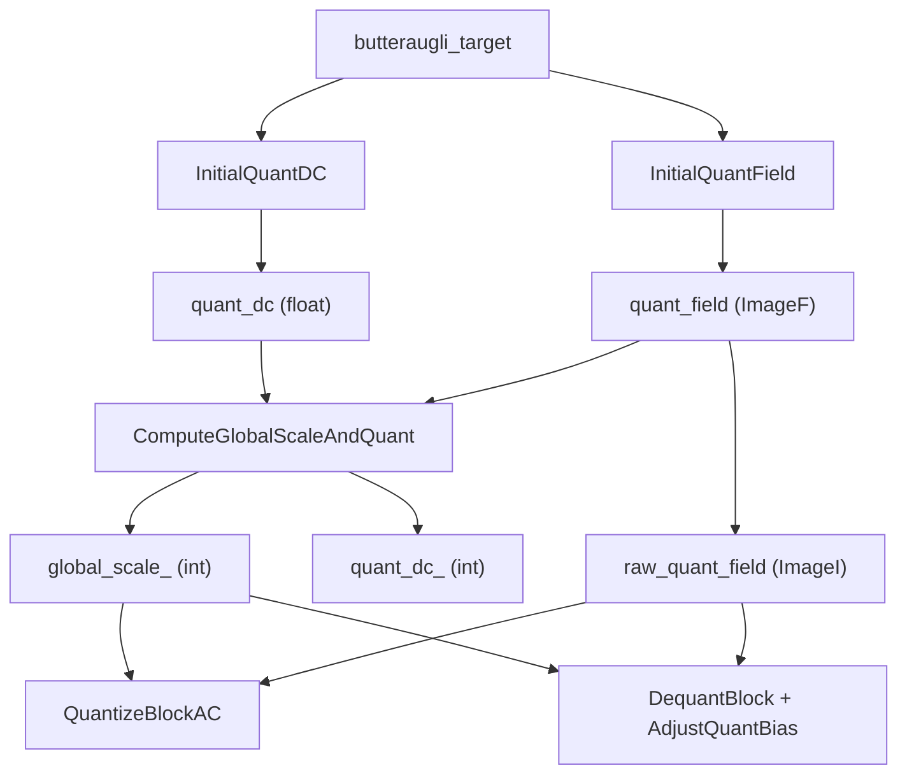

# Quantization



The quantization system maps floating-point DCT coefficients to integers and back.
It has three levels of hierarchy: a single `global_scale` for the entire frame,
a single `quant_dc` for all DC coefficients, and a per-block `quant_ac` for AC
coefficients. On top of this, 17 quantization weight matrices (one per transform type)
define per-coefficient sensitivity across the frequency plane.

Source: `quantizer.h/cc`, `quant_weights.h/cc`, `quantizer-inl.h`, `enc_quant_weights.cc`

## The Global Scale Hierarchy

```
                 global_scale  (int, serialized)
                      |
          +-----------+-----------+
          |                       |
     quant_dc (int)         quant_ac[x,y] (int, per block)
          |                       |
   inv_quant_dc              inv_quant_ac
   = 65536/(gs×qdc)         = 65536/(gs×q)
          |                       |
   dc_step[c]               ac_step[c,k]
   = inv_quant_dc            = inv_quant_ac
     × kDCQuant[c]             × DequantMatrix[kind,c,k]
                                × dm_multiplier[c]
```

### Key Constants

```
kGlobalScaleDenom     = 65536
kGlobalScaleNumerator = 4096
kDefaultQuant         = 64
```

Default constructor: `global_scale_ = 65536/64 = 1024`, `quant_dc_ = 64`.

### DC Quantization Constants

```
kInvDCQuant[3] = { 4096.0, 512.0, 256.0 }     // X, Y, B
kDCQuant[3]    = { 1/4096, 1/512, 1/256 }
```

Y gets 8× finer DC quantization than B, and 2× finer than X. The X channel
(chrominance) gets 16× finer quantization than B — reflecting butteraugli's
extreme sensitivity to DC-level color shifts in the opponent channel.

## InitialQuantDC: Distance to DC Quantization

`enc_adaptive_quantization.cc:1250-1262`

```
kDcQuantPow = 0.83
kDcQuant    = 1.0959
kDcMul      = 0.3

butteraugli_target_dc = max(0.5 × target,
                            min(target,
                                0.3 × pow(target/0.3, 0.83)))
dc_quant = min(kDcQuant / butteraugli_target_dc, 50.0)
```

The `pow(target/0.3, 0.83)` compresses the DC target range — at low distances,
DC quantization grows slowly (diminishing returns on DC precision).

| butteraugli_target | target_dc | dc_quant |
|---|---|---|
| 0.5 | 0.25 | 4.38 |
| 1.0 | 0.83 | 1.33 |
| 2.0 | 1.48 | 0.74 |
| 5.0 | 3.24 | 0.34 |
| 10.0 | 5.79 | 0.19 |

## ComputeGlobalScaleAndQuant

Converts floating-point quant_dc and quant_field into the integer representation:

```
kQuantFieldTarget = 5
scale = 65536 × (quant_median - quant_MAD) / 5

global_scale_ = clamp(scale, 1, 32768)
// Also: scale ≤ quant_dc × 4096 × 1.6 (ensures quant_dc_ >= ~10)

quant_dc_ = round(quant_dc × 65536 / global_scale_ + 0.5)
```

The global scale is chosen so the median integer quant value is ~5. The MAD
(median absolute deviation) subtraction gives more integer resolution to
spatially varying images — for a flat quant field, MAD ≈ 0 and median maps
directly to 5.

## Quantization Matrices (DequantMatrices)

17 matrices, one per `QuantTable` enum value, each with 3 channels. The matrix
values are **dequantization weights** — higher weight = finer quantization = more bits.

### Encoding Modes

| Mode | Description |
|------|-------------|
| `kQuantModeLibrary` | Predefined table from library defaults |
| `kQuantModeDCT` | Distance-band interpolation (general DCTs) |
| `kQuantModeDCT4` | 4×4 with per-coefficient multipliers |
| `kQuantModeDCT4X8` | 4×8 with multiplier |
| `kQuantModeAFV` | Asymmetric basis weights |
| `kQuantModeID` | Identity: bulk/edge/corner weights |
| `kQuantModeDCT2` | Hierarchical 2×2 subdivision weights |
| `kQuantModeRAW` | Explicit JPEG-style table |

### Distance-Band Interpolation

For DCT-family modes, weights are defined by distance bands interpolated across
the frequency plane. Given `num_bands` bands and a coefficient at position (x, y):

```
distance = sqrt((x × scale/(cols-1))² + (y × scale/(rows-1))²)
    where scale = (num_bands - 1) / (sqrt(2) + 1e-6)

weight = bands[floor(d)] × (bands[ceil(d)] / bands[floor(d)])^frac
```

This is **geometric interpolation** (log-linear), not linear. Adjacent bands
define a ratio, and the weight transitions smoothly between them on a log scale.
This matches the roughly logarithmic relationship between frequency and
perceptual importance.

Band values are delta-coded from the seed (band[0]):
```
Mult(v) = (1 + v)     if v > 0
         = 1/(1 - v)   if v ≤ 0
bands[i] = bands[i-1] × Mult(distance_bands[c][i])
```

### Library Default Seeds (Band[0] Values)

The seed value is the weight for the lowest-frequency AC coefficient. Higher
seed = finer quantization at low frequencies.

| QuantTable | X seed | Y seed | B seed | Bands |
|-----------|--------|--------|--------|-------|
| DCT 8×8 | 3,150 | 560 | 512 | 6 |
| DCT 16×16 | 8,997 | 3,191 | 1,158 | 7 |
| DCT 32×32 | 15,718 | 7,306 | 3,804 | 8 |
| DCT 64×64 | 23,966 (×0.9) | 8,380 (×0.9) | 4,493 (×0.9) | 8 |
| DCT 128×128 | 47,932 (×1.8) | 16,760 (×1.8) | 8,986 (×1.8) | 8 |
| DCT 256×256 | 95,865 (×3.6) | 33,521 (×3.6) | 17,972 (×3.6) | 8 |

Larger transforms get proportionally larger seeds. The scaling pattern:
- 64×64: 0.9× base
- 128×128: 1.8× (2× of 64×64)
- 256×256: 3.6× (2× of 128×128)

### Identity and DCT2×2 (Special Modes)

Identity uses 3 weights per channel: `{bulk, edge, corner}`.

```
X: {280, 3160, 3160}    Y: {60, 864, 864}    B: {18, 200, 200}
```

DCT2×2 uses 6 hierarchical weights per channel for three subdivision levels.

## Encode-Side Quantization (QuantizeBlockAC)

```
qac = (global_scale / 65536) × quant_ac[block]
inv_qm = 1 / DequantMatrix[kind, c, k]

quantized[k] = round(coefficient[k] × inv_qm[k] × qac × qm_multiplier)
               if |val| >= threshold, else 0
```

### Dead-Zone Thresholds

The thresholds provide aggressive zeroing of small coefficients:

```
Y channel:  {0.575, 0.6, 0.6, 0.6}    per quadrant
            adjusted to {0.56, 0.56, 0.56, 0.62} for ≥ 8×8
X/B:        {0.58, 0.62, 0.62, 0.62}
For blocks ≥ 4 coefficients: thresholds -= 0.00744 × xsize × ysize, min 0.5
```

Standard rounding uses threshold 0.5 (round-to-nearest). These thresholds are
> 0.5, biasing toward zero — small coefficients are more likely to be zeroed,
saving entropy at the cost of slight distortion.

### Channel Scale Multipliers

Frame header fields `x_qm_scale` and `b_qm_scale` (default 2):

```
x_qm_multiplier = 1.25^(x_qm_scale - 2)

distance > 2.5 → x_qm_scale ≥ 4
distance > 5.5 → x_qm_scale ≥ 5
distance > 9.5 → x_qm_scale ≥ 6
```

At higher target distances, X and B channels are quantized more coarsely
relative to Y, saving chroma bits where they matter less.

## Decode-Side Dequantization

### AdjustQuantBias (Bias Correction)

```
kDefaultQuantBias[4] = {
    0.9453,    // X channel, |q|==1
    0.9299,    // Y channel, |q|==1
    0.9501,    // B channel, |q|==1
    0.145      // kBiasNumerator, |q|≥2
}

if quant == 0:   output = 0
if |quant| == 1: output = sign(quant) × kDefaultQuantBias[c]
if |quant| >= 2: output = quant - 0.145 / quant
```

The bias correction accounts for the non-uniform distribution of quantization
residuals. For `|q| == 1`, the optimal reconstruction point is slightly below
1.0 (around 0.93–0.95) because the true value is more likely to be near the
dead zone boundary. For `|q| >= 2`, the `0.145/q` correction shrinks large
values slightly, following the observation that residuals approximate a
Cauchy-like 1/(1+x²) distribution.

### Full Dequantization

```
scaled_dequant = 65536 / (global_scale × quant_ac)
bias_corrected = AdjustQuantBias(quantized_int)
dequant_value = bias_corrected × DequantMatrix[kind,c,k] × scaled_dequant × dm_multiplier[c]
```

Where `dm_multiplier = (1/1.25)^(x_qm_scale-2)` for X, similar for B, 1.0 for Y.

## Adaptive Quantization Field

The per-block `quant_ac` values come from the adaptive quantization system, starting
from a base value:

```
kAcQuant = 0.765
quant_ac = kAcQuant / butteraugli_target
```

This is then spatially modulated by the AQ masking pipeline (see
[Adaptive Quantization](../perceptual/adaptive-quantization.md)) and optionally
refined through iterative butteraugli feedback.

### AdjustQuantField: AC Strategy Unification

For multi-block transforms, per-8×8 quant values must be unified:

```
kLimit = 1.541
kMul   = 0.564

mean_max_mixer = max(0, 1.0 - (target - kLimit) × kMul)

unified_q = mean_max_mixer × max_q + (1 - mean_max_mixer) × mean_q
```

At high quality (low target): uses max of constituent blocks (preserve worst case).
At low quality (high target): uses mean (avoid over-quantizing large blocks).

## FindBestQuantization: Butteraugli Feedback Loop

For speed ≤ Kitten, runs 2–4 iterations of encode-decode-compare:

```
Iterations 0–1: kPow = 0.2
    Where distortion > target:
        quant_field *= diff        // increase quant to use more bits
    Where distortion ≤ target:
        quant_field *= pow(diff, 0.2)   // gently reduce quant

Iteration 1: clamp to prevent drift:
    quant = max(quant, 0.4 × quant + 0.6 × initial_quant)

Iterations 2+: only adjust tiles exceeding target (no quality improvement)
```

The `TileDistMap` aggregates per-pixel butteraugli differences into per-block
distortion using a 16th-norm (scaled by 1.2):

```
tile_dist = 1.2 × (weighted_mean(pixel_diff^16))^(1/16)
```

The 16th-norm strongly weights the worst pixels but doesn't collapse to a
pure max, providing a stable optimization target.
